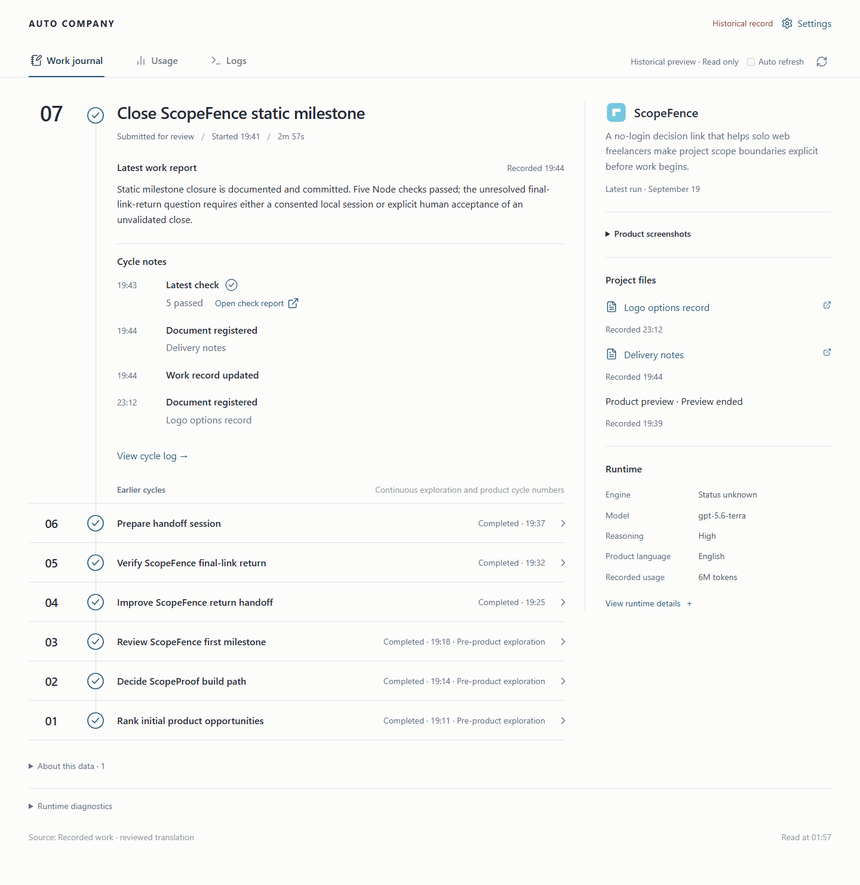
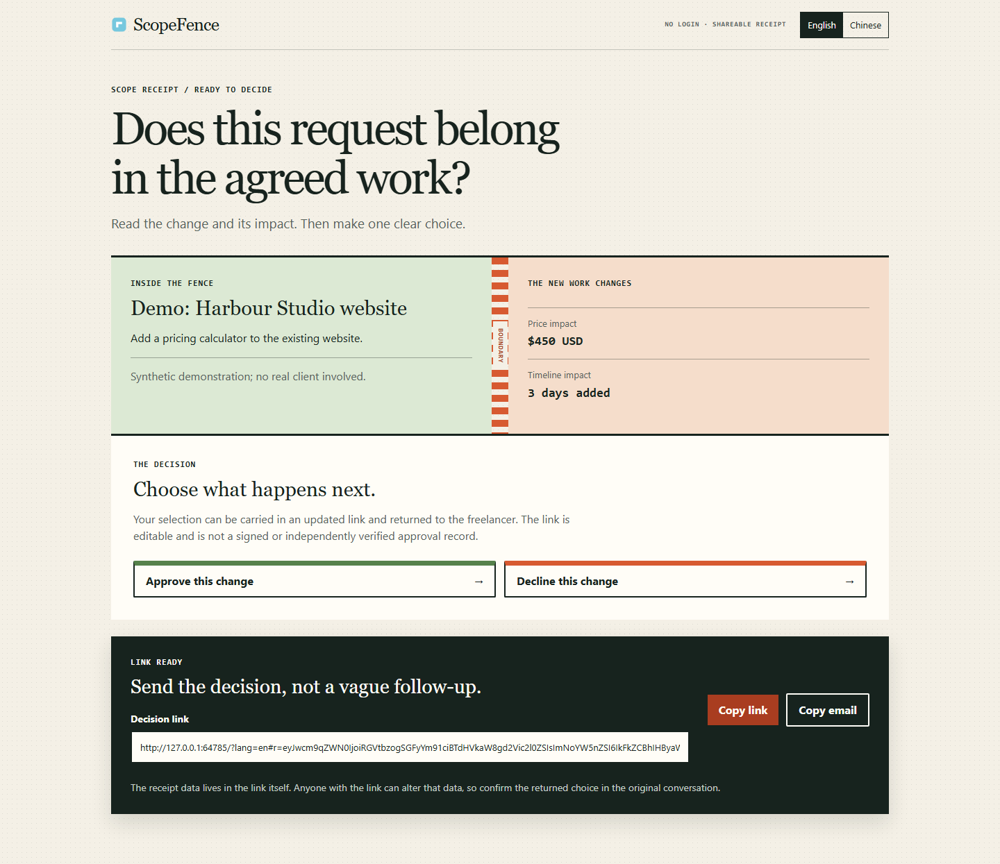
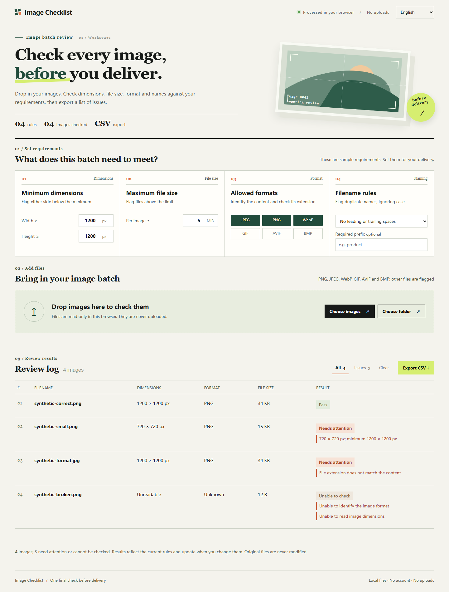
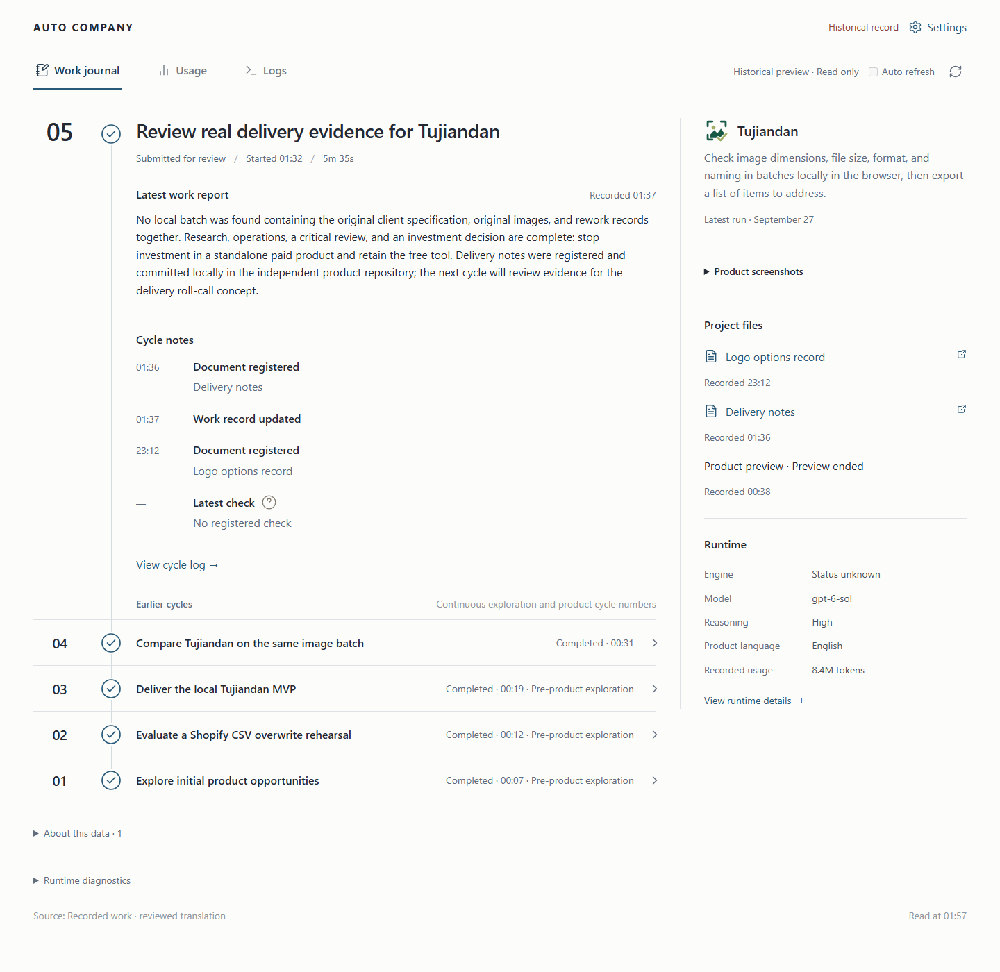
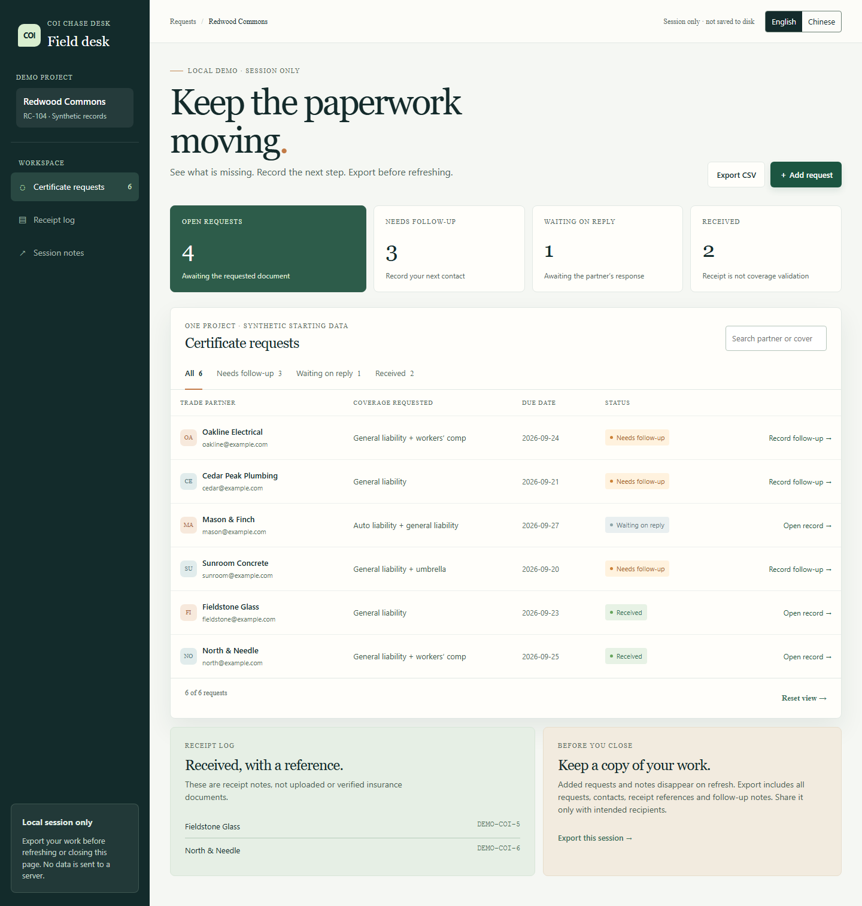
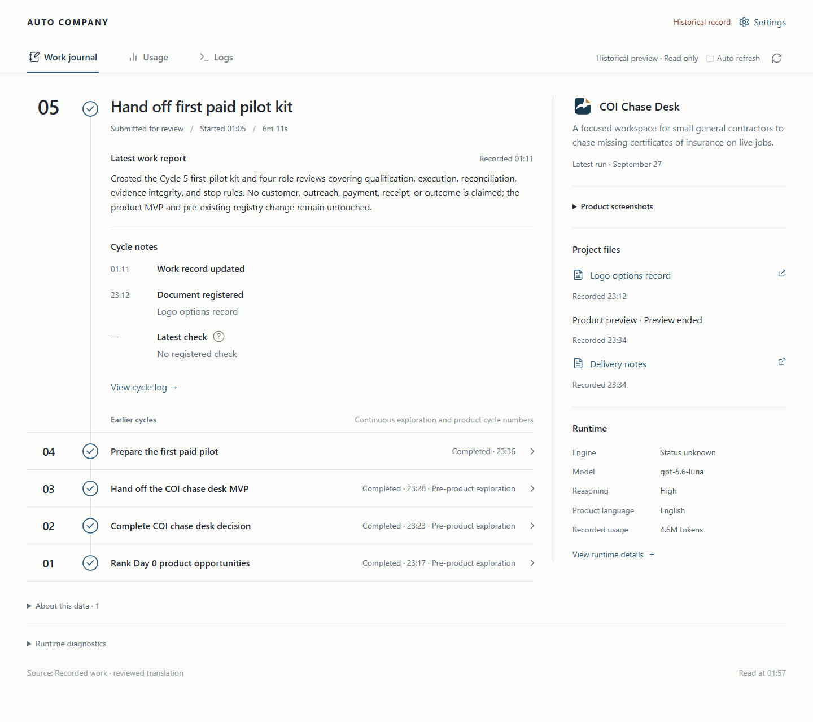

<div align="center">

# Auto Company

**An AI company framework for continuous autonomous work** <a href="README-ZH.md"></a>

Powered by **Agentic Workflows**, this project provides 14 **AI agent role definitions**, each drawing on an expert's approach to its domain.
The team can research products, make decisions, and write code autonomously within human-configured goals, permissions, and budgets. Deployment, publication, and marketing depend on the tools and authorization available; continuous operation depends on services and model availability.

Powered by Claude Code (default) and [Codex CLI](https://www.npmjs.com/package/@openai/codex) on macOS + Windows/WSL, with a local dashboard on both hosts.

Optional Cursor and OpenAI-compatible adapters require explicit configuration. See the [adapter guide](ENGINE_ADAPTERS.md) for their capabilities and limits.

[](#dependencies)
[](#windows-wsl-quick-start)
[![Codex CLI](https://img.shields.io/badge/Engine-Codex%20CLI-orange?logo=data:image/svg%2Bxml;base64,PHN2ZyB2aWV3Qm94PSIwIDAgMjQgMjQiIHhtbG5zPSJodHRwOi8vd3d3LnczLm9yZy8yMDAwL3N2ZyIgZmlsbD0id2hpdGUiPjxwYXRoIGQ9Ik0yMi4yODE5IDkuODIxMWE1Ljk4NDcgNS45ODQ3IDAgMCAwLS41MTU3LTQuOTEwOCA2LjA0NjIgNi4wNDYyIDAgMCAwLTYuNTA5OC0yLjlBNi4wNjUxIDYuMDY1MSAwIDAgMCA0Ljk4MDcgNC4xODE4YTUuOTg0NyA1Ljk4NDcgMCAwIDAtMy45OTc3IDIuOSA2LjA0NjIgNi4wNDYyIDAgMCAwIC43NDI3IDcuMDk2NiA1Ljk4IDUuOTggMCAwIDAgLjUxMSA0LjkxMDcgNi4wNTEgNi4wNTEgMCAwIDAgNi41MTQ2IDIuOTAwMUE2LjA2NTEgNi4wNjUxIDAgMCAwIDE5LjAyIDE5LjgxODJhNS45ODQ3IDUuOTg0NyAwIDAgMCAzLjk5NzctMi45MDAxIDYuMDQ2MiA2LjA0NjIgMCAwIDAtLjczNTgtNy4wOTdaTTguNzQ5IDYuNzU3OGE0LjQxMTggNC40MTE4IDAgMCAxIDcuMzY3MyAxLjE0NDQgNC4zOTg2IDQuMzk4NiAwIDAgMS0uMjkyOCA0LjIyODVsLTQuNzA3LTIuNzIxNHYtMi42NTE1Wk02LjUzMzIgMTQuNjU0YTQuNDExOCA0LjQxMTggMCAwIDEtMS4xMjkzLTcuMzcgNC4zOTg2IDQuMzk4NiAwIDAgMSA0LjEzNTItMS4zOWwyLjM2MTUgNC4wOTN2NS4zMDJMNi41MzMyIDE0LjY1NFptLTEuODQ4LTEuNTcyYTQuNDExOCA0LjQxMTggMCAwIDEgNi4yMzgtNi4yMjYgNC4zOTg2IDQuMzk4NiAwIDAgMSAzLjg0MzMgMi44MzhsLTQuNzA3IDIuNzIxdjUuMzAxNUw0LjY4NTIgMTMuMDgyWm0xMC41NjU4IDQuMTZhNC40MTE4IDQuNDExOCAwIDAgMS03LjM2NzMtMS4xNDQzIDQuMzk4NiA0LjM5ODYgMCAwIDEgLjI5MjgtNC4yMjg1bDQuNzA3IDIuNzIxNHYyLjY1MTRabTIuMjE1OC03Ljg5NmE0LjQxMTggNC40MTE4IDAgMCAxIDEuMTI5MyA3LjM3IDQuMzk4NiA0LjM5ODYgMCAwIDEtNC4xMzUyIDEuMzlsLTIuMzYxNS00LjA5M1Y5LjE4Nmw1LjM2NzQgMi4xODZabTEuODQ4IDEuNTcyYTQuNDExOCA0LjQxMTggMCAwIDEtNi4yMzggNi4yMjYgNC4zOTg2IDQuMzk4NiAwIDAgMS0zLjg0MzMtMi44MzhsNC43MDctMi43MjFWOS4xODZsNS4zNzQgMy4wOTZaTTEyIDE2LjUxNmE0LjQxMTggNC40MTE4IDAgMCAxLTQuNDExOC00LjQxMThjMC0yLjQzNDggMS45NzctNC40MTE4IDQuNDExOC00LjQxMThzNC40MTE4IDEuOTc3IDQuNDExOCA0LjQxMTgtMS45NzcgNC40MTE4LTQuNDExOCA0LjQxMThaIi8+PC9zdmc+&logoColor=white)](https://www.npmjs.com/package/@openai/codex)
[](#dependencies)
[](LICENSE)

</div>

---

## Dashboard and Product Preview

[](presentation/showcase/scopefence-timeline-en.png)

ScopeFence across **7 real completed cycles: 3 exploration + 4 product cycles**. Exploration, delivery and later work share one continuous timeline, with original identities, timestamps, checks and logs preserved.

The timeline uses a reviewed English presentation overlay. Product screenshots show the published copies after human-directed refinement and functional checks. These changes do not add historical cycles or establish paid demand. Open an image at full size; see [capture provenance and reproduction](presentation/showcase/README.md).

<table>
<tr><th colspan="2"><a href="examples/scopefence/">ScopeFence</a> · 7 · 3 exploration + 4 product</th></tr>
<tr><td colspan="2">Communicate scope, price and schedule changes through an editable decision link.</td></tr>
<tr><td width="50%" valign="top"><a href="presentation/products/scopefence-en-result.png"></a></td><td width="50%" valign="top"><a href="presentation/showcase/scopefence-timeline-en.png"></a></td></tr>
<tr><th colspan="2"><a href="examples/tujiandan/">Image Checklist</a> · 5 · 3 exploration + 2 product</th></tr>
<tr><td colspan="2">Review image dimensions, size, format and names locally, then export a checklist.</td></tr>
<tr><td width="50%" valign="top"><a href="presentation/products/tujiandan-en.png"></a></td><td width="50%" valign="top"><a href="presentation/showcase/tujiandan-timeline-en.png"></a></td></tr>
<tr><th colspan="2"><a href="examples/coi-chase-desk/">COI Chase Desk</a> · 5 · 3 exploration + 2 product</th></tr>
<tr><td colspan="2">Record follow-ups and document receipts, review the history and export session records.</td></tr>
<tr><td width="50%" valign="top"><a href="presentation/products/coi-chase-desk-en-full.png"></a></td><td width="50%" valign="top"><a href="presentation/showcase/coi-chase-desk-timeline-en.png"></a></td></tr>
</table>

## What Is This?

You start a loop. Each cycle reads the shared work summary, decides what to do, forms a team as needed, executes, updates the summary, and waits before the next cycle. Team creation depends on the model and engine capabilities; errors, budget limits, or a pause request can stop continuation.

```
daemon (launchd / systemd --user, auto-restart on crash)
  └── scripts/core/auto-loop.sh (continuous loop)
        ├── reads PROMPT.md + consensus.md
        ├── LLM CLI call (Codex CLI / Claude Code)
        │   ├── reads CLAUDE.md (charter + guardrails)
        │   ├── reads .claude/skills/team/SKILL.md (teaming method)
        │   ├── forms an Agent Team as needed
        │   ├── executes: research, coding, deploy, marketing
        │   └── updates memories/consensus.md (work summary)
        ├── failure handling: rate-limit wait / circuit breaker / consensus rollback
        └── sleep -> next cycle
```

Each cycle is an independent CLI call. `memories/consensus.md` is the main work summary loaded for the next cycle. Product files, repositories, configuration, identity records, logs, and usage data also persist across cycles.

## 🗂️ Product Center

The local Product Center brings explicitly connected product runs into one catalog. Switching products changes only what you are viewing; importing an existing run starts as read-only and never starts a model by itself.

| Capability | What it does |
|---|---|
| Product catalog | Search and open connected products while keeping each product's identity, history, usage and recorded outcomes separate. |
| Safe import | Connect an existing run or source for read-only review first; incompatible or incomplete sources stay unavailable for execution. |
| Explicit work requests | Continue a product or prepare a new exploration only after you submit a request. Viewing and refreshing do not create work. |
| One ordered queue | One managed slot runs requests in order. A request keeps the slot for its full continuous loop and cleanup, rather than switching products after each cycle. |
| Visible recovery | Preparation, failures, protective pauses and uncertain states remain visible after reload so you can review them before retrying or resuming the queue. |

Start it from the repository, then open `http://127.0.0.1:8810/center`:

```bash
# macOS / WSL
make center
```

```powershell
# Windows PowerShell
.\scripts\windows\center-win.ps1
```

See the [Product Center guide](docs/product-center.md) for source registration, execution-domain setup, queue controls and recovery behavior.

## Generated Applications

The [example catalog](examples/README.md) contains 22 independently runnable public examples, including 14 newly completed products and selected historical work. Each entry provides startup instructions, limitations and provenance; new local runs continue to write into `projects/`.

The examples cover professional data review, image delivery, shared meals, travel pacing and family creation. Published copies preserve the original product direction while refining components and repairing real interactions; original reports and unsuccessful conclusions are not rewritten for the showcase.

Frontend work now uses a task-led design skill adapted from Anthropic. In a [three-product prompt comparison](presentation/frontend-study/README.md), the retained instructions won two pairs and tied one, with all 12 shared desktop/mobile scenarios passing.

## Where To Start (By Platform)

- Windows users: start from [Windows (WSL) Quick Start](#windows-wsl-quick-start), then read the [Windows + WSL Setup Guide](i18n/en/docs/windows-setup.md)
- macOS users: start from [macOS Quick Start](#macos-quick-start), then see [Command Quick Reference](#command-quick-reference-by-platform)

## Languages and Documentation

One language setting controls the Dashboard, documentation links and new product work. The initial default follows your computer's display language: Chinese uses `zh-CN`; other languages use `en`. WSL uses the Windows display language when available.

Choose a language in the Dashboard or run `make language LANGUAGE=en` (`LANGUAGE=zh-CN` for Chinese). On Windows, use `python scripts/core/localization.py set --language en`. These entrypoints update the same preference. A product keeps its starting language across AI iterations, pauses and restarts. You can change the preference while it runs; the change applies to the next product cycle. The Dashboard shows both the current and next language. See the [language guide](i18n/en/README.md) for the product-cycle boundary and Windows startup parameters.

All bundled skills are written in English; their user-facing work follows the product's language. Commands, identifiers, protocol headings and raw tool errors retain their original form. Customized source instructions, existing products, logs and consensus history are preserved; changing language does not translate them retroactively.

| Guide | English | 中文 |
|---|---|---|
| Repository index | [Index](i18n/en/INDEX.md) | [索引](INDEX.md) |
| Windows + WSL | [Setup guide](i18n/en/docs/windows-setup.md) | [安装指南](docs/windows-setup.md) |
| Company rules | [Charter](CLAUDE.md) | [公司章程](i18n/zh-CN/CLAUDE.md) |
| Engine adapters | [Adapter guide](ENGINE_ADAPTERS.md) | [引擎适配器](i18n/zh-CN/ENGINE_ADAPTERS.md) |
| Usage and budgets | [Governance guide](docs/usage-governance.md) | [用量与预算治理](i18n/zh-CN/docs/usage-governance.md) |
| Operations and troubleshooting | [Common tasks and errors](i18n/en/docs/troubleshooting.md) | [常见操作与排错](docs/troubleshooting.md) |

## Team Lineup (14 Roles)

This is not "you are a generic developer". It is "you are DHH" style role prompting with real expert mental models.

| Layer | Role | Expert Persona | Core Strength |
|------|------|------|----------|
| **Strategy** | CEO | Jeff Bezos | PR/FAQ, flywheel thinking, Day 1 mindset |
| | CTO | Werner Vogels | Design for failure, API-first architecture |
| | Inversion | Charlie Munger | Inversion, pre-mortems, misjudgment checklist |
| **Product** | Product Design | Don Norman | Affordance, mental models, human-centered design |
| | UI Design | Matias Duarte | Task-led layouts, typography and consistent components |
| | Interaction Design | Alan Cooper | Goal-directed design, persona-driven decisions |
| **Engineering** | Full-Stack | DHH | Convention over configuration, majestic monolith |
| | QA | James Bach | Exploratory testing, testing is not checking |
| | DevOps/SRE | Kelsey Hightower | Automation first, reliability discipline |
| **Business** | Marketing | Seth Godin | Purple cow, permission marketing, smallest viable audience |
| | Operations | Paul Graham | Do things that do not scale, ramen profitability |
| | Sales | Aaron Ross | Predictable revenue, funnel systems |
| | CFO | Patrick Campbell | Value-based pricing, unit economics |
| **Intelligence** | Research Analyst | Ben Thompson | Aggregation theory, value chain analysis |

Plus 30+ reusable skills (deep research, scraping, financial modeling, SEO, security audit, UX audit, etc.).

## macOS Quick Start

```bash
# Prerequisites:
# - macOS
# - Codex CLI or Claude Code installed and authenticated
# - Python 3.10+ (python3), Git, and make available
# - Available model quota

# Clone
git clone https://github.com/MaxMiksa/Auto-Company.git
cd Auto-Company

# Foreground run with Claude Code (default, live output)
make start

# Or foreground run with Codex CLI
ENGINE=codex make start

# Alternatively, install and start the daemon for your chosen engine
make install
# Codex instead of the default Claude:
ENGINE=codex make install
```

## Windows (WSL) Quick Start

```powershell
# Prerequisites:
# - Windows 10/11 + WSL2 (Ubuntu), with systemd --user available
# - Codex CLI or Claude Code installed and authenticated inside WSL
# - Python 3.10+ (python3), Git, and make available inside WSL
# - Python 3.10+ (python) on Windows for the PowerShell dashboard entry
# - Available model quota

# Clone
git clone https://github.com/MaxMiksa/Auto-Company.git
cd Auto-Company

# Start (daemon mode via PowerShell, default engine = claude)
.\scripts\windows\start-win.ps1

# Switch engine explicitly
.\scripts\windows\start-win.ps1 -Engine codex

# Status
.\scripts\windows\status-win.ps1

# Stop
.\scripts\windows\stop-win.ps1
```

For monitoring, dashboard, and autostart commands, see the [Windows + WSL Setup Guide](i18n/en/docs/windows-setup.md).

## Command Quick Reference (By Platform)

| Task | macOS / WSL (Terminal) | Windows (PowerShell) |
|---|---|---|
| Start | `make start` | `.\scripts\windows\start-win.ps1` |
| Status | `make status` | `.\scripts\windows\status-win.ps1` |
| Live logs | `make monitor` | `.\scripts\windows\monitor-win.ps1` |
| Last cycle output | `make last` | `.\scripts\windows\last-win.ps1` |
| Cycle summary | `make cycles` | `.\scripts\windows\cycles-win.ps1` |
| Stop | Foreground: `make stop`; daemon: `make pause` | `.\scripts\windows\stop-win.ps1` |
| Web dashboard | `make dashboard` | `.\scripts\windows\dashboard-win.ps1` |
| [Product center](docs/product-center.md) | `make center` | `.\scripts\windows\center-win.ps1` |
| Install daemon | `make install` | Auto-installed/started by `start-win.ps1` |
| Uninstall daemon | `make uninstall` | `wsl -d Ubuntu --cd <repo_wsl_path> bash -lc 'make uninstall'` |
| Pause daemon | `make pause` | `wsl -d Ubuntu --cd <repo_wsl_path> bash -lc 'make pause'` |
| Resume daemon | `make resume` | `wsl -d Ubuntu --cd <repo_wsl_path> bash -lc 'make resume'` |

In daemon mode, `make stop` alone can trigger an automatic restart. Use `make pause` to keep the daemon stopped, then `make resume` to continue.

### macOS Sleep Prevention (macOS Only)

macOS screen lock usually does not kill processes, but system sleep can pause work. For long runs:

```bash
make start-awake   # Start loop and keep system awake until loop exits

# If loop is already running (after make start):
make awake         # Attach caffeinate to PID in .auto-loop.pid
```

Notes:
- Both commands depend on built-in `caffeinate`
- `make awake` exits automatically when target PID exits

## Architecture & Technology Stack (5-Layer Architecture)

Auto-Company is not a simple LLM API wrapper, but a highly decoupled **Multi-Agent System (MAS)**. Its technical architecture is divided into 5 distinct layers:

```text
┌────────────────────────────────────────────────────────────┐
│ 5. Observability & HITL (Human-In-The-Loop) Layer          │
│    [ Dashboard ]  [ File-based Steering (consensus.md) ]   │
├────────────────────────────────────────────────────────────┤
│ 4. Workflow Routing & Teaming Layer                        │
│    [ Role-based Teaming ]  [ Prompt Workflow Guidance ]   │
├────────────────────────────────────────────────────────────┤
│ 3. Agentic Models & Cognition Layer                        │
│    [ 14 Expert Personas ]  [ 30+ Skill Arsenal ]           │
├────────────────────────────────────────────────────────────┤
│ 2. Orchestration & State Machine Layer                     │
│    [ Auto-Loop ]  [ Persistent State ]  [ Resilience ]    │
├────────────────────────────────────────────────────────────┤
│ 1. Execution Engine & Infrastructure Layer                 │
│    [ Engine Adapters ]  [ Cross-Platform Daemon ]        │
└────────────────────────────────────────────────────────────┘
```

### Layer 5: Observability & HITL (Human-In-The-Loop)
*   **File-based Steering**: After stopping the current run, edit `Next Action` in `memories/consensus.md` for the next task, or `Human Overrides` for continuing constraints, then start or resume. Editing during a cycle can conflict with the model's updates and recovery; it does not guarantee an immediate change of direction.
*   **Logs & Dashboard**: `logs/` saves engine-emitted output after known credential redaction, together with per-cycle results and available usage records. Output detail depends on the engine; complete reasoning traces are not guaranteed. `dashboard/` organizes current and historical cycle reports and results, alongside runtime controls, status, usage, budgets, and logs. It does not track individual agents' activity.

### Layer 4: Workflow Routing & Teaming
*   **Role-based Teaming**: The team skill recommends selecting 2-5 relevant roles from 14 definitions for the current task. Actual sub-agent creation and concurrency depend on the executing model and engine; these are not 14 permanent workers or a fixed-size scheduler.
*   **Workflow Guidance**: `PROMPT.md` asks the team to move from ideation to validation and then implementation. These are prompt instructions, not an enforced business state machine; the third engine cycle does not guarantee a completed or deployed product.

### Layer 3: Agentic Models & Cognition
*   **Expert Personas Injection**: Instead of generic prompts, it injects specific mental models of historical figures/industry leaders (e.g., Bezos's "Working Backwards", Munger's "Checklists", DHH's "Majestic Monolith") into `.claude/agents/`, giving decisions extreme business and engineering depth.
*   **Skill Arsenal**: A pluggable system located in `.claude/skills/` (e.g., `frontend-design`, `security-audit`). Specific methodologies are encapsulated as tools that any awakened Agent can "temporarily load".
*   **Behavioral Rules**: `CLAUDE.md` instructs agents not to delete repositories or force-push, among other rules. The framework also checks specific runtime and configuration boundaries; prompt rules do not block arbitrary commands or provide an operating-system sandbox.

### Layer 2: Orchestration & State Machine
*   **The Auto-Loop**: `scripts/core/auto-loop.sh` schedules repeated CLI calls, waits, and failure handling. It can continue while services, model access, budgets, and runtime checks permit.
*   **Consensus Memory**: `memories/consensus.md` carries the natural-language work summary between calls. Structured product identity, usage, configuration, and recovery records are stored separately; the summary is not the entire runtime state.
*   **Resilience & Recovery**: Built-in circuit breakers (cooldown triggered by consecutive errors), rate-limit backoff (auto-sleep on 429 errors), and consensus recovery after failed cycles. Human Overrides, `.auto-company.local`, and the framework's root `.gitignore` have targeted protection. Product code changes and external side effects are not automatically rolled back.

### Layer 1: Execution Engine & Infrastructure
*   **Engine Adapters**: The main entrypoints use **Claude Code** (default) or **Codex CLI**. Optional **Cursor** and **OpenAI-compatible** adapters require explicit opt-in and configuration; their tools and team capabilities differ. See the [adapter guide](ENGINE_ADAPTERS.md).
*   **Cross-Platform Daemon**: macOS uses `launchd` for auto-start and crash recovery; Windows/WSL runs via `systemd --user` inside a WSL container, controlled and kept alive externally via PowerShell.
*   **Sandbox Boundary**: Currently relies on underlying CLI configurations (like Codex's `danger-full-access` or Claude's `bypassPermissions`). System-level operations occur directly in the host environment (or WSL container).

## Operating Model

### Default Workflow Guidance

The prompt recommends the following progression. These labels describe work stages, which may span multiple engine cycles; they are not a completion deadline or an enforced state machine.

| Cycle | Action |
|------|------|
| Cycle 1 | Brainstorm: each agent proposes ideas, rank top 3 |
| Cycle 2 | Validate #1: Munger pre-mortem + Thompson market check + Campbell economics -> **GO / NO-GO** |
| Cycle 3+ | GO -> create repo, build, and deploy when authorized. NO-GO -> move to the next idea. The prompt asks for implementation rather than discussion-only cycles |

### Six Standard Workflows

These are suggested role collaboration chains; the executing model selects the actual work and participants.

| # | Workflow | Collaboration Chain |
|---|------|--------|
| 1 | **New Product Evaluation** | Research -> CEO -> Munger -> Product -> CTO -> CFO |
| 2 | **Feature Development** | Interaction -> UI -> Full-stack -> QA -> DevOps |
| 3 | **Product Launch** | QA -> DevOps -> Marketing -> Sales -> Ops -> CEO |
| 4 | **Pricing and Monetization** | Research -> CFO -> Sales -> Munger -> CEO |
| 5 | **Weekly Review** | Ops -> Sales -> CFO -> QA -> CEO |
| 6 | **Opportunity Discovery** | Research -> CEO -> Munger -> CFO |

## Steering

To change direction, stop the foreground run with `make stop`, pause a macOS/WSL daemon with `make pause`, or use the Windows stop command below. Wait until the run has stopped before editing, then start or resume it.

| Method | Action |
|------|------|
| **Change direction** | After stopping, edit "Next Action" in `memories/consensus.md`; use "Human Overrides" for continuing constraints |
| **Pause** | `make pause` (macOS/WSL daemon mode) or `.\scripts\windows\stop-win.ps1` (Windows entry) |
| **Resume** | `make resume` |
| **Review outputs** | Check `docs/*/` for artifacts generated by agents |

Agents may report unresolved P1 blockers, but must preserve existing P1 entries and cannot add checked-off ones. Resolve blockers only after stopping and completing pending recovery; see [P1 issues and human edits](i18n/en/docs/troubleshooting.md#p1-issues-and-human-edits).

## Safety Guardrails

`CLAUDE.md` gives agents the following behavioral rules. They complement specific framework checks, but are not a general command-denial mechanism or a guarantee that every agent action is blocked when it violates a rule:

- Do not delete GitHub repos (`gh repo delete`)
- Do not delete Cloudflare projects (`wrangler delete`)
- Do not delete system directories (`~/.ssh/`, `~/.config/`, etc.)
- Do not perform illegal activity
- Do not leak credentials into public repositories
- Do not force push to main/master
- Create all new projects under `projects/`

## Configuration

Environment variable overrides:

```bash
ENGINE=claude make start                   # Default engine; optional adapters: see adapter guide
ENGINE=codex make start                    # Switch to codex
MODEL=sonnet make start                    # Optional model override
CLAUDE_PERMISSION_MODE=bypassPermissions make start  # Claude permission mode
LOOP_INTERVAL=60 make start                # 60s interval (default 30)
CYCLE_TIMEOUT_SECONDS=3600 make start      # 1h cycle timeout (default 1800)
MAX_CONSECUTIVE_ERRORS=3 make start        # Circuit-breaker threshold (default 5)
CODEX_SANDBOX_MODE=workspace-write make start  # Optional sandbox override
CLAUDE_BIN=/usr/local/bin/claude make start     # Optional Claude binary override
CODEX_BIN=/usr/local/bin/codex make start       # Optional Codex binary override
```

Windows `start-win.ps1` writes the same values into `.auto-loop.env`:

```powershell
.\scripts\windows\start-win.ps1 -Engine claude -ClaudePermissionMode bypassPermissions
.\scripts\windows\start-win.ps1 -Engine codex -SandboxMode workspace-write
# Backward compatibility:
.\scripts\windows\start-win.ps1 -Engine codex -CodexSandboxMode workspace-write
```

No automatic engine fallback is performed. If the selected engine is missing, startup fails fast.

## Project Structure

```
auto-company/
├── CLAUDE.md              # Company charter (mission + guardrails + team + workflows)
├── PROMPT.md              # Per-cycle execution prompt (convergence rules)
├── Makefile               # Common command entry
├── INDEX.md               # script index + responsibility table
├── dashboard/             # Local web status dashboard (macOS: make dashboard, Windows: dashboard-win.ps1)
├── scripts/
│   ├── core/              # Core loop and control scripts (auto-loop/monitor/stop)
│   ├── windows/           # Windows entry/guardian/autostart scripts
│   ├── wsl/               # WSL systemd --user daemon scripts
│   └── macos/             # macOS launchd daemon scripts
├── memories/
│   └── consensus.md       # Shared handoff memory across cycles
├── docs/                  # Agent outputs (14 folders + Windows guide)
├── projects/              # Workspace for generated projects
├── logs/                  # Loop logs
└── .claude/
    ├── agents/            # 14 agent definitions (expert personas)
    ├── skills/            # 30+ reusable skills
    └── settings.json      # Permissions + Agent Teams switch
```

## Dependencies

| Dependency | Notes |
|------|------|
| **Claude Code / Codex CLI** | Supported CLI engines (default: Claude) |
| Optional engine adapters | Cursor and OpenAI-compatible; explicit opt-in required, see [adapter guide](ENGINE_ADAPTERS.md) |
| **macOS or Windows + WSL2 (Ubuntu)** | macOS uses launchd; Windows uses WSL execution core |
| **Python 3.10+** | Required: `python3` on macOS/WSL; also `python` on Windows for the PowerShell dashboard and local language commands |
| `git` | Repository checkout and product repository management |
| `node` | Runtime for npm-installed CLI tools |
| `make` | Start/stop/monitor command entry (WSL/macOS) |
| `jq` | Recommended for log processing |
| `gh` | Optional, GitHub CLI |
| `wrangler` | Optional, Cloudflare CLI |

## FAQ

### 1) WSL `.sh` fails with `^M` / `bad interpreter`

- Cause: CRLF line endings in shell scripts
- Fix:
  - Keep LF rules in `.gitattributes`
  - Run `git config core.autocrlf false && git config core.eol lf`

### 2) WSL says `codex`/`claude` command not found

- Cause: CLI installed on Windows only, missing in WSL
- Fix: install `node` and your chosen CLI inside WSL (`@openai/codex` or Claude Code)

### 3) Claude waits for permission and cycles appear blocked

- Cause: strict permission mode in Claude CLI
- Fix: set `CLAUDE_PERMISSION_MODE=bypassPermissions` (or pass `-ClaudePermissionMode bypassPermissions` in `start-win.ps1`)
- Verify: check `logs/auto-loop.log` for `Engine: claude` and `PermissionMode: ...`

### 4) `make install` fails inside WSL

- Cause: no available `systemctl --user` in current session
- Fix:
  - Verify WSL systemd is enabled
  - Run `systemctl --user --version`
  - Re-open WSL session and retry if needed

## Disclaimer

This is an **experimental project**:

- **Daemon mode works on both macOS and WSL**: launchd on macOS, systemd --user on WSL
- **Windows entry requires WSL**: PowerShell is only the control layer
- **Still under test**: runs, but stability is not guaranteed
- **Costs money**: each cycle consumes model quota
- **Permissions matter**: default engine settings allow broad local actions without routine approval prompts. Review engine permissions and `CLAUDE.md`; prompt rules alone do not provide isolation
- **No warranty**: review `docs/` and `projects/` regularly

Suggested rollout: start with `make start` (foreground), then move to daemon mode (`make install` on macOS/WSL, `.\scripts\windows\start-win.ps1` on Windows).

## Acknowledgments

Thanks to the contributors whose reports, fixes, and proposals have shaped Auto Company:

| Contributor | Contribution | Reference |
|---|---|---|
| [@JasonQWJ](https://github.com/JasonQWJ) | Early macOS Dashboard proposal and implementation that informed the `v1.1.0` design | [#1](https://github.com/MaxMiksa/Auto-Company/pull/1) |
| [@cnwillz](https://github.com/cnwillz) | macOS Dashboard support proposal that informed the cross-platform implementation | [#2](https://github.com/MaxMiksa/Auto-Company/pull/2) |
| [@chbndrhnns](https://github.com/chbndrhnns) | Reported the missing executable bit that prevented first startup | [#5](https://github.com/MaxMiksa/Auto-Company/issues/5) |
| [@Sittichai9680](https://github.com/Sittichai9680) | Advanced Linux/WSL Dashboard support | [#9](https://github.com/MaxMiksa/Auto-Company/pull/9) |
| [@allenter](https://github.com/allenter) | Advanced cost monitoring, budget alerts, and executable script entrypoints | [#13](https://github.com/MaxMiksa/Auto-Company/pull/13), [#14](https://github.com/MaxMiksa/Auto-Company/pull/14) |
| [@maxgoff](https://github.com/maxgoff) | Documented engines surviving Cycle timeouts and proposed full process-tree cleanup | [Fork contribution](https://github.com/maxgoff/Auto-Company/commit/861d678fc3070d385e3771591cb6468f2857aa05) |
| [@omergeiger](https://github.com/omergeiger) | Informed Human Overrides preservation and P1 issue gates | [Human Overrides](https://github.com/omergeiger/Auto-Company/commit/cb1dba1b687eaf700258411f562fd2986586c82d), [P1 issues](https://github.com/omergeiger/Auto-Company/commit/4730a7d03c25e49035be95e48bda428f983e176e) |
| [@NicklasSandin](https://github.com/NicklasSandin) | Advocated English documentation and an English-language workflow | [#21](https://github.com/MaxMiksa/Auto-Company/pull/21) |
| [@mdoganexe](https://github.com/mdoganexe) | Reported and contributed fixes for systemd installation, WSL distribution selection, and locale-dependent configuration handling | [#27](https://github.com/MaxMiksa/Auto-Company/pull/27), [#28](https://github.com/MaxMiksa/Auto-Company/pull/28) |

- [nicepkg/auto-company](https://github.com/nicepkg/auto-company) - initial macOS edition
- [continuous-claude](https://github.com/AnandChowdhary/continuous-claude) - cross-session shared notes
- [ralph-claude-code](https://github.com/frankbria/ralph-claude-code) - exit signal interception
- [claude-auto-resume](https://github.com/terryso/claude-auto-resume) - usage-limit resume pattern

## License

The framework is distributed under the [MIT License](LICENSE). Bundled third-party components retain their own license terms and notices.

## 🤝 Contribution & Contact

Welcome to submit Issues and Pull Requests!
Any questions or suggestions? Please contact Zheyuan (Max) Kong (Carnegie Mellon University, Pittsburgh, PA).

Zheyuan (Max) Kong: kongzheyuan@outlook.com | zheyuank@tepper.cmu.edu
GitHub: https://github.com/MaxMiksa/Auto-Company
