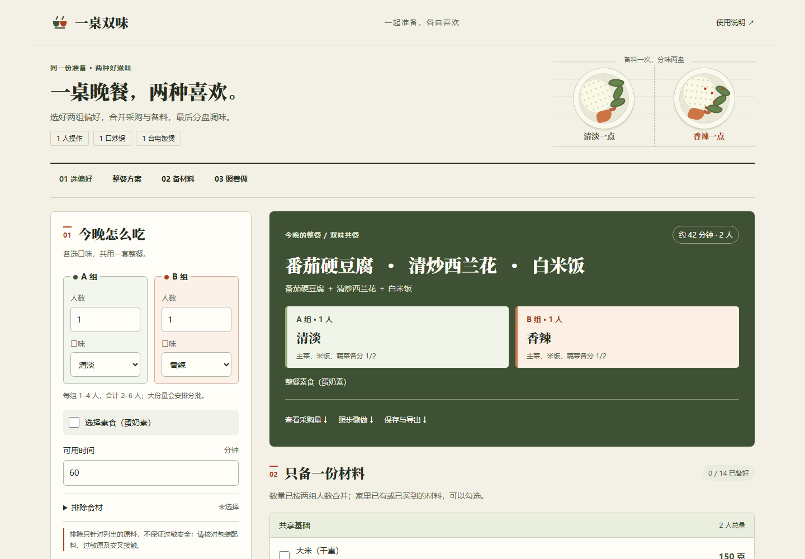
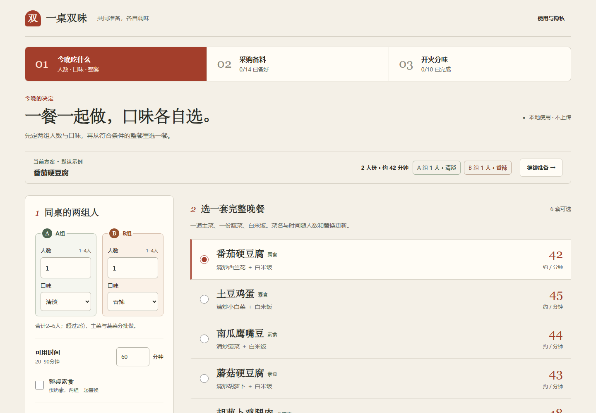
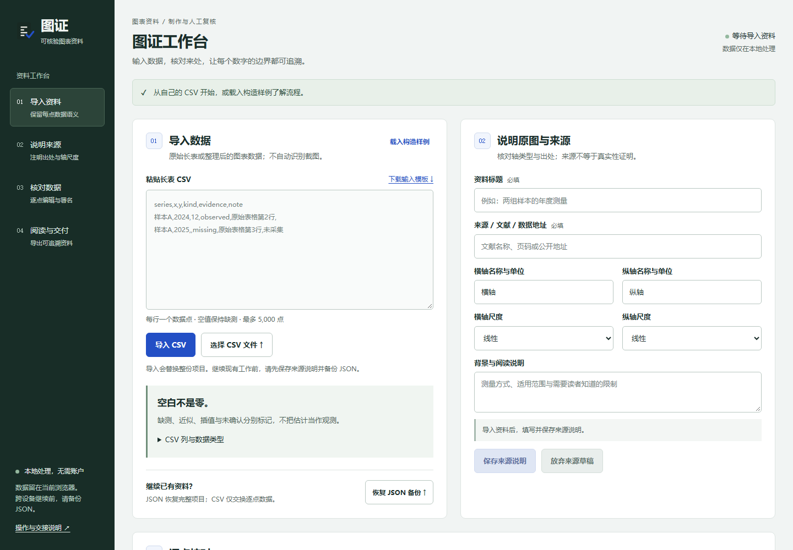
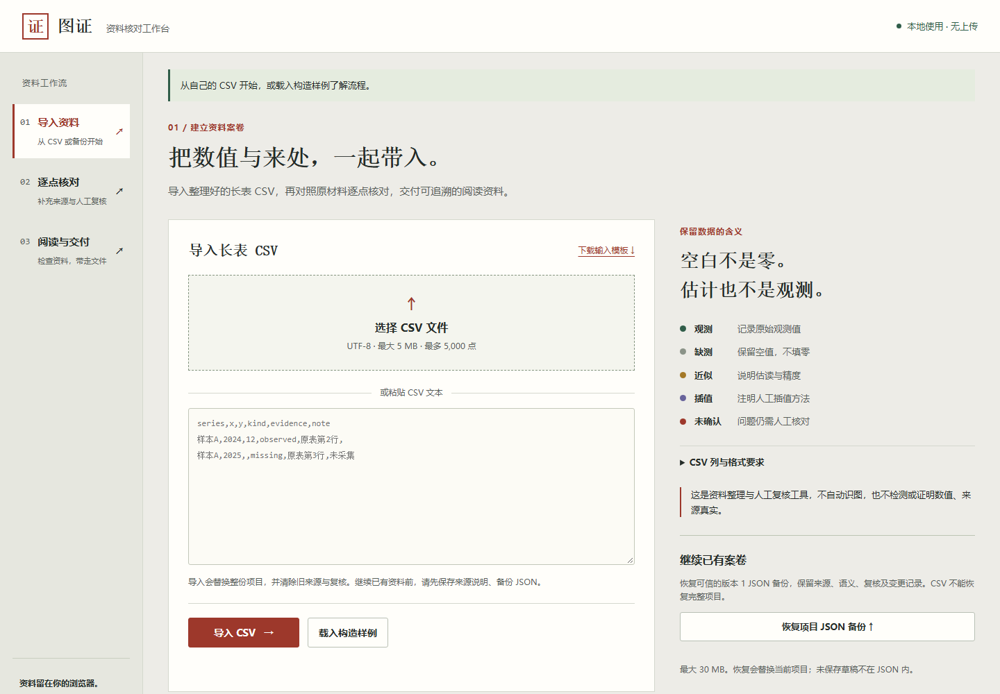
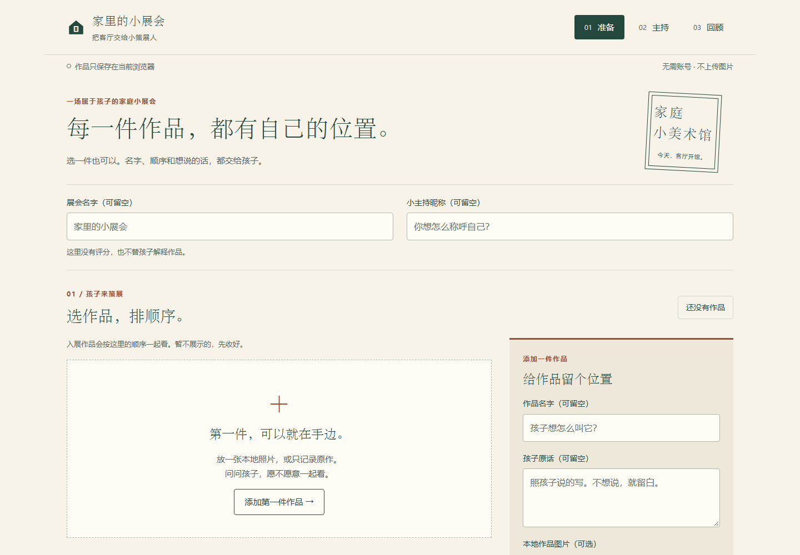
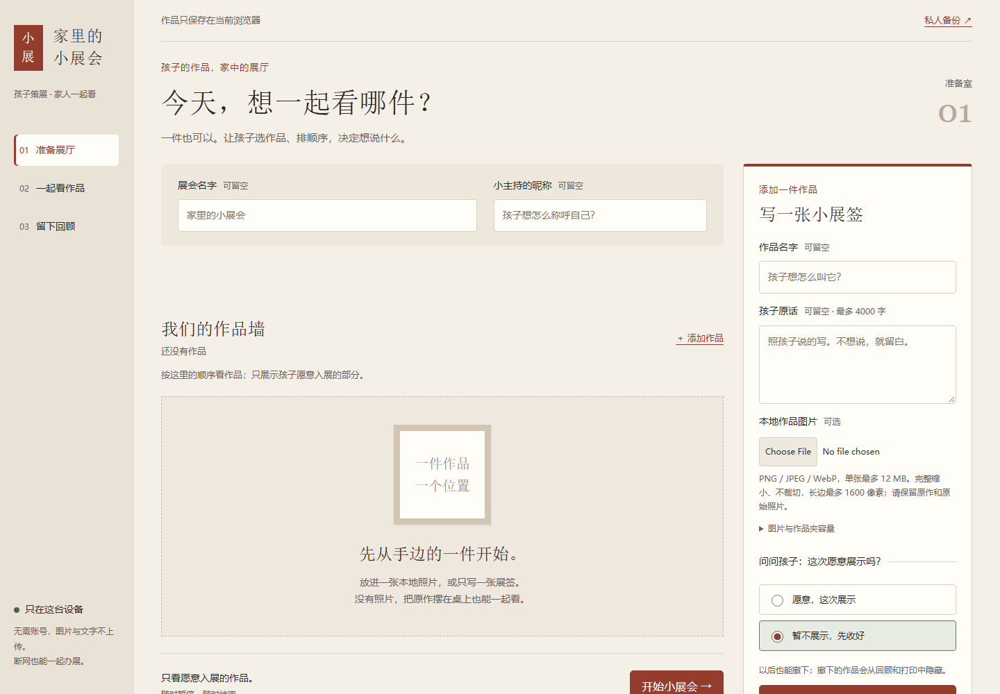

# Frontend redesign comparison / 前端重新设计对照

2026-10-02 · [Interactive comparison / 交互对照](index.html) · [Previous study correction / 上轮结论修正](../frontend-study/README.md) · [Read-boundary audit / 读取审计](../frontend-study/READ-BOUNDARY-AUDIT.md)

## Current choice / 当前采用

After reviewing B/C, the user preferred B. Auto Company has restored the B design baseline and added a [dedicated finishing pass](../../.claude/skills/frontend-polish/SKILL.md) for already working interfaces. C remains a historical comparison, not the retained default. The additional finishing prompt has integration checks, not a new visual A/B result.

用户查看 B/C 后更认可 B。当前已恢复 B 版设计基线，并为已可用界面补充独立精修轮。C 保留为历史对照，不作为默认方向；新增精修提示词已做接入检查，尚不构成新一轮视觉 A/B 结论。

## What changed

The previous task, role, skill and evaluation all asked for refinement while preserving the product identity and structure. The models did read those instructions. The reported gains concerned components and copy; hierarchy and identity scores did not improve. That evidence did not demonstrate a substantial redesign.

The prompt used for the C experiment selected **refine** or **redesign/new-build** from the user's intent. Explicit redesign may change layout, palette, typography, components, interaction flow and framework. Business rules, data meaning, recovery, export and privacy remain obligations. Existing code alone no longer forces refinement.

Three new C runs used the same original product source as the previous experiment, actual `gpt-6.1-sol/high`, and ended naturally. Each input contained only its current product and complete task materials. The task authorization, context scope, reading order and prompt mode changed together: **this is a before/after redesign comparison, not a single-variable causal experiment**. B is the previous refinement output, not a new concurrent control. No manual product patches were applied after the C runs finished.

## Screenshots / 实拍对照

All images below are unedited browser captures. The viewer also includes the working state and mobile views: 24 images total. Desktop: 1440 × 1000; mobile: 390 × 844. Each pair uses the same business inputs and semantic state. Natural timestamps and generated IDs differ; scroll positions follow the relevant content in each layout. The family artwork is a synthetic image fixture, not a child's real work. Native file-picker labels follow the test browser's language.

| Product / 产品 | B: refinement / 上轮精修 | C: redesign / 本轮重做 |
| --- | --- | --- |
| One Table, Two Tastes / 一桌双味 |  |  |
| Chart Evidence / 图证 |  |  |
| Family Art Show / 家里的小展会 |  |  |

## Acceptance and limits

Independent Chromium checks passed **12/12 scenarios**: three products × B/C × desktop/mobile. They covered the actual workflows, reload/recovery, invalid inputs, and real exported files. Two additional desktop/mobile checks imported an actual B meal-plan backup into C, retained both progress types after reload, and re-exported identical bytes. The working states matched after excluding natural timestamps and random identifiers. C source hashes remained unchanged during acceptance. The parent also operated all three C products directly: five-person meal quantities and saved progress; chart source edits invalidating review; and art-show pause/resume with notes retained in the review. This does not establish real-user preference, cross-browser certification, actual cooking or physical printing.

| Product | Observed improvement | Remaining tradeoff |
| --- | --- | --- |
| One Table, Two Tastes | Separate choosing, shopping and cooking workspaces; more shopping items visible on mobile; applied plan distinguished from draft | Warm paper styling remains; supporting copy is still substantial |
| Chart Evidence | Import, review and delivery become distinct stages; source material sits next to the review table | More navigation; the professional visual style is not clearly superior on every screen |
| Family Art Show | Desktop artwork gets a dedicated dark stage next to the note-taking area; gallery and review have distinct spaces | Mobile artwork/header pushes host controls farther down the page |

The parent reviewed labeled B/C images, so this is **not blind aesthetic scoring**. Layout changes are clear, but all three C runs converged on warm paper and red-brown accents. **Visual diversity is not solved; C is not declared universally better.** The explicit redesign mode was initially retained for expressing the then-requested authorization and producing functional structural changes; the user's subsequent choice of B supersedes that adoption. The C artifacts remain comparison candidates; they do not silently replace the published product examples.

See [manifest.json](manifest.json) for image and frozen-source hashes. The manifest describes the frozen C inputs; the later prompt choice does not alter those inputs or the captured products.

## 中文结论

上轮效果小的主要原因是任务要求“精修、保留原身份和结构”，主提示、角色、技能和评分口径又重复了这个约束；并非模型没有读到技能。旧报告的增分来自组件和文字，不能用来证明布局、辨识度或风格多样性明显提升。

本轮解除视觉约束后，三款产品确实重新划分了工作区，功能、数据和恢复边界经独立实测保留。父代理逐款实际操作后，当时保留了“精修／重新设计”的提示修正；随后用户选择 B，当前采用已按上述决定恢复。但三款仍趋向暖纸与红棕色，小展会手机版的主持控件也更靠后，因此没有把“发生重做”夸大为“全面更美”或“同质化已解决”。

本轮同时改变了任务授权、输入上下文、阅读顺序和提示模式，不作严格单变量归因。上轮实验的读取边界问题及更正已公开；新 C 三组最终工具记录未发现读取父评审资料或其他产品内容，但没有操作系统文件打开审计，不能称为硬隔离。
