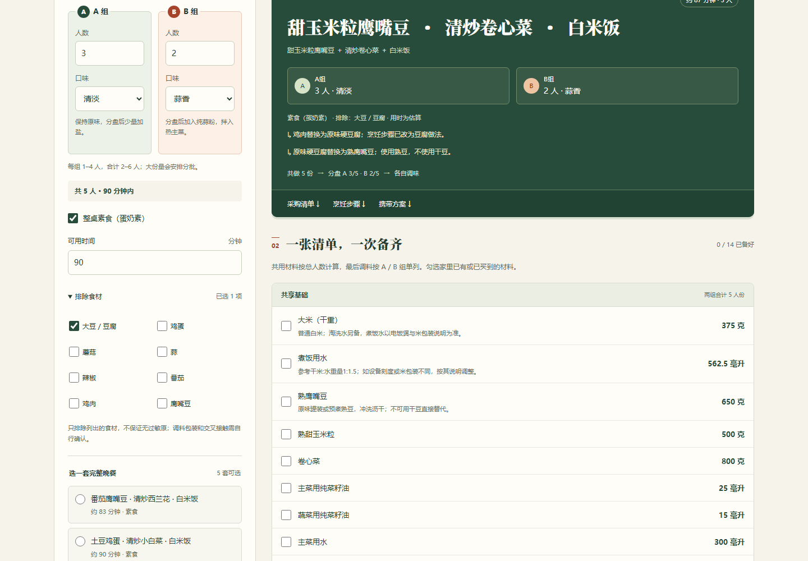
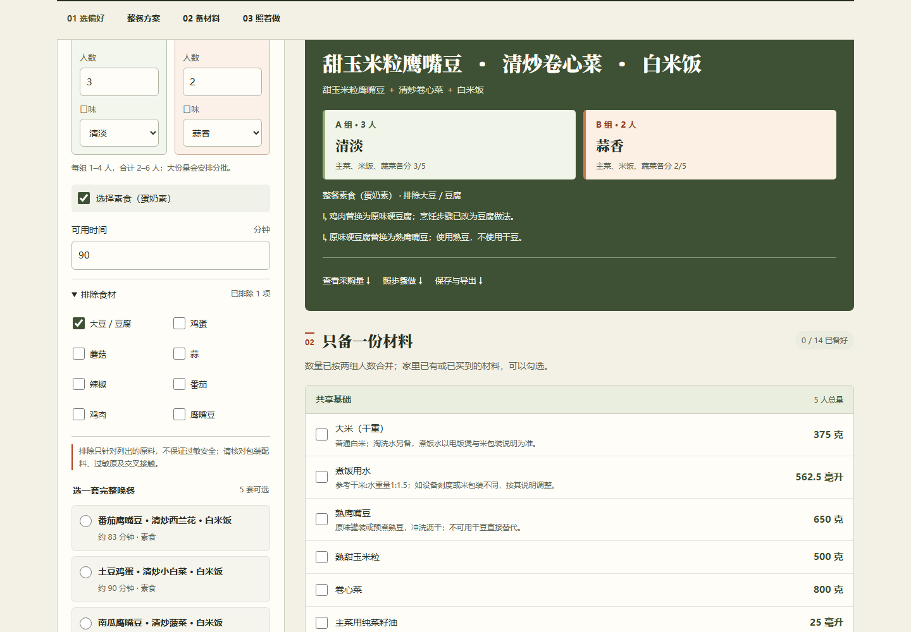
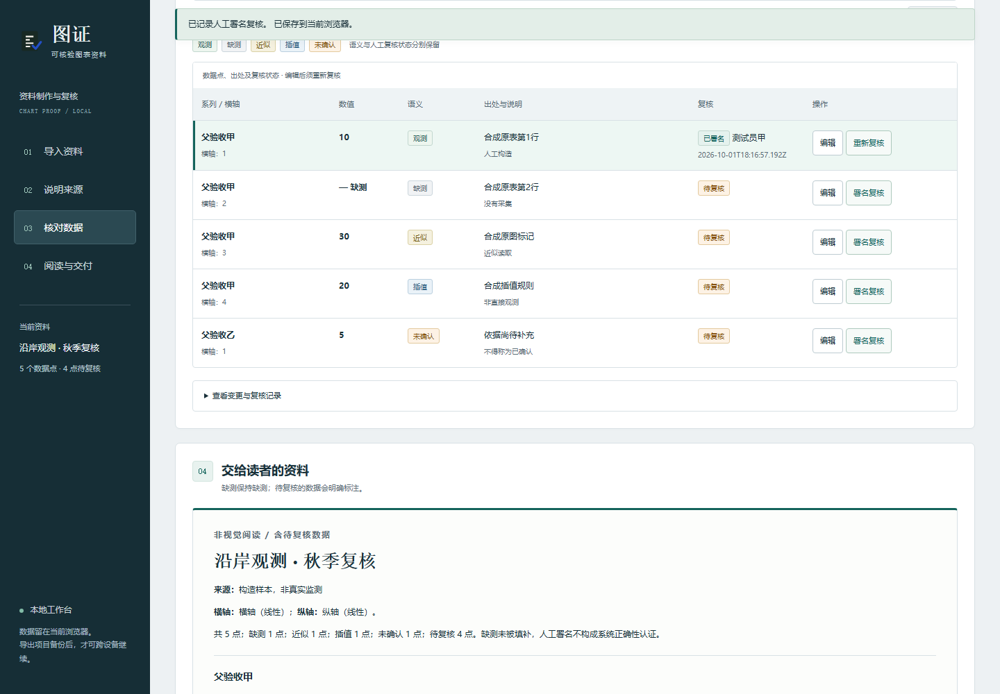
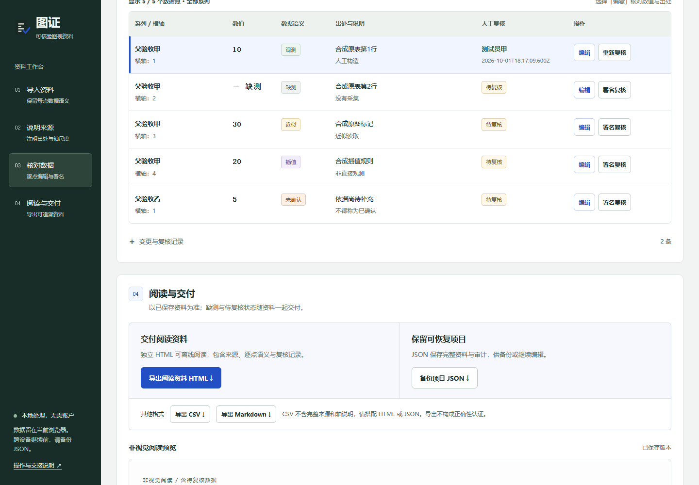
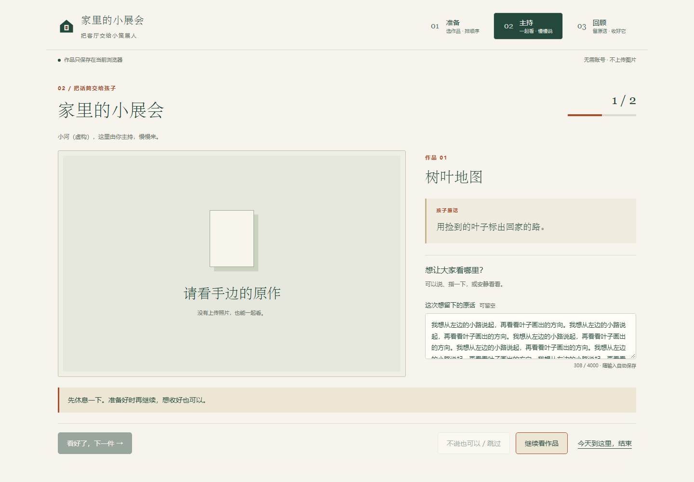
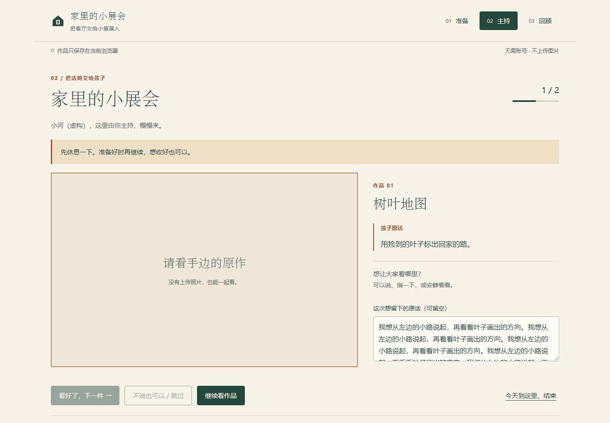

# Frontend prompt comparison / 前端提示词对照

2026-10-02 · `frontend-task-first-v1`

**In a non-blind review of refinement outputs, B scored higher for two products and tied for one.** All 12 common browser scenarios passed (three products × two versions × desktop/mobile). This records the review outcome, not an isolated causal result. A later session audit found cross-workspace reads of experiment materials; see the correction below. The manually refined public examples are a separate deliverable.

**非盲评的精修产物中，B 两项评分较高、一项持平。** 三个产品、两版提示词、桌面与手机组成的 12 次共同浏览器验收全部通过。这是产物评分记录，不是隔离实验的因果结论；后续会话审计发现模型越过各运行目录读取实验材料，详见下面的更正。公开案例的人工精修是另一项交付。

## Audit correction / 审计更正

See the [public read-boundary audit summary / 读取边界审计摘要](READ-BOUNDARY-AUDIT.md). Original session bodies and machine paths remain private.

The original preparation copied the repository, including historical `projects/`, into each arm. Some model calls enumerated those files. The two Family Art Show arms also successfully read parent-directory CASE/manifests; A read the study protocol and freeze checks, and B read session settings. The protocol was read before any arm had completed and contained the planned procedure, not another arm's generated result. The audited calls did not establish reads of another A/B arm's generated frontend. File availability, filename enumeration and content reads are distinct observations.

原准备器将含历史 `projects/` 的仓库复制到每个运行目录，部分调用列出了这些文件。小展会两臂还成功读取父目录的 CASE/清单；A 读取过实验协议与冻结检查，B 读取过会话设置。A 读协议时尚无任何一臂完成，协议包含预定流程，不含其他臂产物。已审调用未证明六臂读取过另一臂生成的前端。文件可见、文件名枚举和成功读取内容是不同层次的证据。

The task referred to `CASE.md` but supplied its content inline rather than creating that file, a visible trigger for searching parent directories. Separate directories and `workspace-write` did not provide read isolation. We withdraw the strict single-variable/independent-run characterization; the real screenshots and functional outcomes remain valid. The follow-up redesign supplies the actual CASE file and only the current product in each input root, and audits observed reads separately. This reduces input contamination without claiming an operating-system read boundary.

任务要求读取 `CASE.md`，却只把内容内嵌在任务中、没有生成该文件，是向父目录寻找资料的可见诱因。独立目录与 `workspace-write` 没有提供读取隔离。撤回严格单变量、独立运行的表述；真实截图及功能结果仍有效。后续重做实验补齐 CASE 文件，每个输入根目录只带当前产品，并单独核对实际读取；这减少输入污染，但不声称实现了操作系统级读取隔离。

## What changed / 改了什么

A used the frontend instructions from base commit `8becd542a3c76d286b21b27e15b99d71a4f2d0ca`. B changed the frontend skill, UI role, and their handoff in the main/team prompts. It asks the team to start with the actual user task and content priority, specify component states and typography, preserve an existing product's identity, and verify real screens. Redundant explanations move out of the main task; relevant errors, privacy and limits remain readable. It prescribes no shared palette or framework.

A 为上述基线的原规则；B 修改前端技能、UI 角色及主提示与团队交接。B 先确定任务、内容优先级、字体与组件状态，再核对实现；精修保留原产品身份，不指定统一配色、模板或框架。删减重复介绍和装饰性小字，必要错误、隐私和限制仍在相关决策处清楚呈现。

Historical file comparisons found **no change to the frontend skill/UI chain across the three earlier commercial-prompt variants**; the earlier ScopeFence also used that chain. This does not support attributing the repeated green appearance to those commercial edits. Conflicting design instructions and weak design-to-implementation handoffs were plausible mechanisms to test, not proven historical causes.

历史文件对照显示，之前三版商业提示调整期间前端技能与 UI 链路没有改变；早期 ScopeFence 也使用同一套前端规则。因此没有证据把相似绿色风格直接归因于商业提示改动。旧规则中“独特设计”与套用常见设计系统、创新须有 10 倍收益的要求相冲突，设计与实现的交接也不够具体；这些是此次检验的机制，不是已证明的历史因果。

The adapted skill includes the original [Anthropic frontend-design source](https://github.com/anthropics/skills/blob/41bbe19d1a1a7eaab5e7bb9050a417e5c6cffc8f/skills/frontend-design/SKILL.md), attribution and [Apache-2.0 license](../../.claude/skills/frontend-design.LICENSE.txt), with additional reference to [OpenAI frontend guidance](https://developers.openai.com/api/docs/guides/frontend-prompt). The [B skill as published for this study](https://github.com/MaxMiksa/Auto-Company/blob/1037a4bae0413e670b4d10a62ddda0e70d3616cb/.claude/skills/frontend-design.md) is an explicit project adaptation; later changes to the current skill do not change this frozen experiment.

## Controls and acceptance / 控制变量与验收

- Three sealed existing products, one separate run directory per version and product; the task, starting product source, fixtures, tooling and permissions were matched within each pair. The intended changed variable was the frontend instruction bundle; the later audit above limits causal interpretation. Up to three runs executed concurrently, without an arbitrary cycle cutoff.
- All six actual session settings were checked: `gpt-6.1-sol`, reasoning effort `high`. All six completed normally. No model substitution was used.
- A common acceptance runner, prepared by the implementation agent and reviewed by the primary agent, used fresh browser contexts, identical inputs/actions, 1440×1000 and 390×844 viewports, actual downloads and source-integrity checks. All six product trees remained unchanged during this acceptance. The primary agent made the final visual judgment.
- The adoption rule was set before results: no new core regression in any pair, B wins at least two pairs, and each win has concrete task/component benefits. Four dimensions use 0–4: blocked, poor, usable but rough, mature/clear, exceptional. Scores are reviewer judgments, not conversion or revenue metrics.

三对使用封存的相同产品起点、相同任务与夹具，每版每项目各一个运行目录；模型及强度均核实为 `gpt-6.1-sol/high`。这并不构成读取隔离。统一验收脚本由实施代理准备、父代理审阅，实际操作和下载保持对称，父代理负责最终视觉判断。原先约定的采用规则是：没有新增核心功能回退，且 B 至少两对胜出，并有具体任务或组件改善。

## Primary-agent review / 父代理评分

Each cell lists **task hierarchy / product identity / component finish / text and information**, followed by the total (maximum 16).

评分顺序为 **任务层级 / 产品辨识度 / 组件完成度 / 文字与信息**；每项 0–4，总分 16。

| Fixed product / 固定项目 | A | B | Judgment / 判断 |
| --- | --- | --- | --- |
| Dual Flavor Table / 一桌双味 | 3 / 3 / 2 / 2 = **10** | 3 / 3 / 3 / 3 = **12** | B: larger readable controls and clearer A/B portions; the mobile result retains explicit 3/5 and 2/5 allocation. B 的控件和正文更易读，两组分量直接对应，手机端仍明确显示分配。 |
| Chart Proof / 图证工作台 | 3 / 2 / 2 / 2 = **9** | 3 / 2 / 3 / 3 = **11** | B: clearer labels, review state and primary actions; denser but readable mobile records; persistent feedback no longer overlays the work area. B 的标签、复核状态和主操作更清楚；手机记录更紧凑，反馈不再遮住工作区。 |
| Family Art Show / 家里的小展会 | 3 / 3 / 3 / 3 = **12** | 3 / 3 / 3 / 3 = **12** | Tie: B makes pause status and ordered works clearer; A keeps mobile hosting controls close at hand. Both preserve the gallery character and consent. 平局：B 的暂停提示、作品顺序更清楚；A 的手机主持操作更容易随时使用。 |

### Same-state screenshots / 同状态实拍

The PNGs are unchanged browser captures of synthetic inputs. Product state is the same within each pair; timestamps and generated IDs naturally differ. Open images at full size. [Hashes and frozen prompt files](manifest.json).

图片直接来自浏览器，使用合成输入，未编辑像素。每对产品状态一致，实际时间戳与新建 ID 自然不同。点击可查看原尺寸；[哈希与冻结提示清单](manifest.json)。

| Product | A: original prompt | B: retained prompt |
| --- | --- | --- |
| Meal result / 餐单结果 |  · [Mobile / 手机](everyday-A-mobile.png) |  · [Mobile / 手机](everyday-B-mobile.png) |
| Reviewed data / 已复核数据 |  · [Mobile / 手机](professional-A-mobile.png) |  · [Mobile / 手机](professional-B-mobile.png) |
| Paused hosting / 暂停主持 |  · [Mobile / 手机](experience-A-mobile.png) |  · [Mobile / 手机](experience-B-mobile.png) |

## Functional evidence and limits / 功能证据与边界

The shared checks exercised meal quantities and cooking batches, saved progress, constraint failure, exports/restores and invalid backups; chart data semantics, source-change review invalidation, draft/filter handling and standalone HTML; artwork ordering, images, pause/continue, saved narration, privacy withdrawal, printing and backup recovery. All 12 scenarios passed without page/console errors or horizontal overflow.

共同检查覆盖餐单数量与分锅、进度保存、无解约束、真实导出/恢复与坏备份；图表数据语义、修改来源后的复核失效、草稿与筛选、独立 HTML；作品顺序、图片、暂停/继续、原话保存、撤下后的隐私、打印与备份恢复。12 次全部通过，无页面或控制台错误、无横向溢出。

The unchanged original checks also passed for each version: meal planner 12 unit + 10 browser checks, chart workbench 15 unit + 10 browser checks, and art show 16 browser checks. The first art-show check run had one local-file path failure per version after copying the test runner; both original failures were retained, and only those two checks were rerun after correcting the acceptance runner's path. Product source and assertions were unchanged. Four additional symmetric long-label checks passed. Image, long-narration and long-label supplements were added for acceptance after generation; they are not represented as pre-frozen inputs.

每版原有检查也全部覆盖通过：餐单 12 项单元与 10 项浏览器检查，图表 15 项单元与 10 项浏览器检查，小展会 16 项浏览器检查。小展会首次各有一项因验收脚本副本的本地路径错误失败；保留失败证据，仅修正验收路径后定向重跑，两项通过，产品源码和断言未变。额外四项对称长标签检查通过。图片、长原话与长标签的验收补充是在生成结束后加入，不冒充事先封存的输入。

This is a **small, non-blinded refinement study**: three products, one generation per arm, no statistical replication and no human customer study. The reviewer had already seen some generated screenshots and knew the versions. It supports a local prompt choice, not universal superiority, new-product originality or increased willingness to pay. Existing product palettes were intentionally preserved, so this is not a test of palette diversity in newly generated products.

这是**小样本、非盲评的精修实验**：三个产品、每臂一次，没有统计重复，也没有真人客户研究。父评审此前已看过部分生成截图且知道版本。它支持本项目选择新的前端提示词，不能证明普遍更优、新产品更原创或付费意愿提升。任务要求保留已有身份，因此也不构成新项目配色多样性的验证。

Two task-packaging ambiguities applied equally: `CASE.md` was referenced but its contents were embedded in the task rather than provided as that file; the art-show fixture requested a missing-title error although the original product deliberately permits unnamed works. Neither was scored against one arm, and the fixture was not rewritten after seeing results. Raw model sessions, private paths and original run copies remain outside the public repository.

两处任务包装歧义对称存在：任务提及 `CASE.md`，但实际以任务正文内嵌提供；小展会夹具要求空标题报错，而原产品允许不命名。两项均未单独处罚某一版本，也没有事后改写夹具。原模型会话、私密路径和原运行副本不公开。
